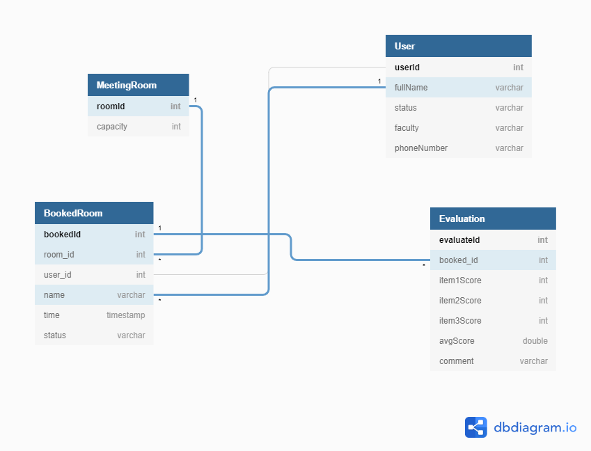
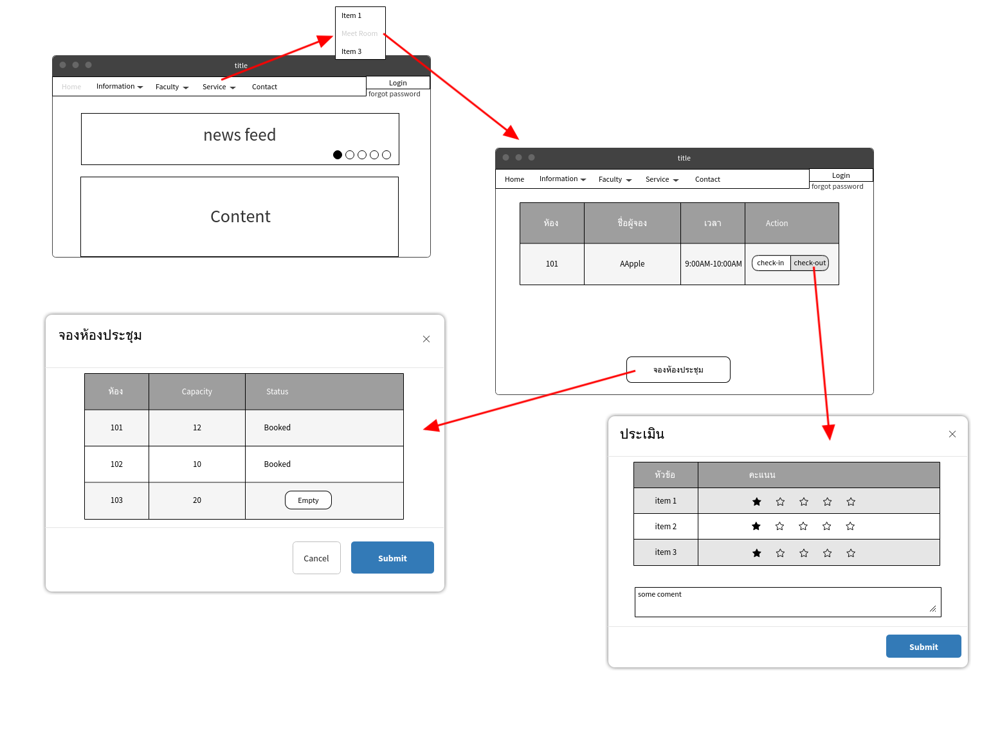

## Question 1

    1. Exceed Camp Project
    โปรเจคนี้เป็นส่วนหนึ่งของค่ายexceed campที่ทางคณะวิศวกรรมศาสตร์คอมพิวเตอร์จัดขึ้นเป็นโปรเจคแรกที่เริ่มเขียนเว็บ โดยใช้ความรู็พื้นฐานของการเขียนเว็บจำพวกHTML,CSS, Javascript เป็นโปรเจคที่หน้าเว็บจะทำงานควบคู่กับตัวฮาร์ดแวร์ทั้งรับ-ส่งข้อมูล

    2. Barcamp Management (github.com/HAYATO-Kz/ProjectISP-Barcamp-management)
    โปรเจคนี้เป็นส่วนหนึ่งของวิชาIndividual Software Process (ISP) เป็นโปรเจคที่สร้างเพื่ออำนวยความสะดวกในงานbarcamp ผู้ใช้สามารถloginด้วย github หรือ email-google แล้วสามารถเลือกว่าได้ว่าจะเป็นผู้พูดหรือผู้ฟัง เป็นโปรเจคที่ฝึกเกี่ยวกับการส่งข้อมูลด้วยREST API ด้วย framework ที่ชื่อว่า DjangoผสมกับReactjs และฝึกเกี่ยวกับการทำงานแบบแบ่งเป็นทีละช่วงๆ ฝึกกระบวนการทำงานแบบsrcumและagile

    3. CD Game Store (front-end: github.com/HAYATO-Kz/Deploy_GameStore, back-end: github.com/TongThanaphon/CDGameStore_API)
    โปรเจคนี้เป็นส่วนหนึ่งของวิชาDatabase เป็นโปรเจคเกี่ยวกับร้านขายของ ที่จะขายซีดีเกม โดยตัวโปรเจคจะเน้นไปที่การจัดการเกี่ยวกับdatabase ใช้database เป็นmongodb ร่วมกับnode.js สร้างback-end ของโปรเจคนี้

    4. CBS
    โปรเจคนี้เป็ฯโปปรเจคจากการฝึกงานที่noburo ทำเว็บสำหรับสถาบันการเงิน เกี่ยวกับการทำสินเชื่อ ใช้คำนวณ จัดเก็บข้อมูล แจ้งเตือนของผู้ใช้สินเชื่อ เป็นโปรเจคที่ได้ฝึกการทำงานด้าน web develop แบบเต็มรูปแบบทั้งfront-end และ back-end มีการฝึกการทำauthenticationของเว็บ การverifyการสมัครเพื่อใช้งานเว็บ

## Question 2

    ESlint คือlinterตัวหนึ่ง ที่จะช่วยทำให้การเขียนโค้ดของเรา เขียนได้ตามกฏมาตรฐานที่คนส่วนมากนิยมเขียนกัน
    สาเหตุที่เลือก คือ เวลาเราเขียนโค้ด อาจจะมีตัวแปรที่ประกาศไว้หรือlibraryบางตัวที่importมาแต่ไม่ได้มีการเรียกใช้ ตัวESlintจะแจ้งเรา ทำให้ง่ายต่อการกำจัดโค้ดส่วนที่ไม่จำเป็นได้

## Question 3

    Feature
        - login
        - ตารางเวลาของห้องประชุม
        - จองห้องประชุม
        - ประเมินความพอใจหลังการใช้ห้องประชุม

    Framework
        - React
        - Node.js

    Database
        - mysql

